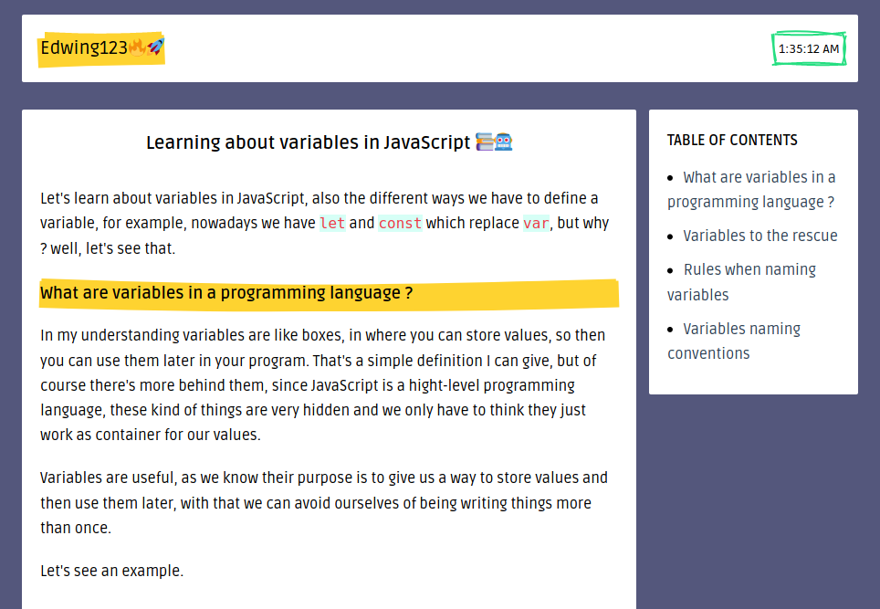

# Learning about variables in JavaScript

This time I talk about variables, what they are, why to use the and more technical information about them. The information may no be 100% correct I guess, but I hope it helps me to understand what variables are and their use and more.

live demo: [here](https://edwing123-testing.netlify.app/)

This is an ongoing project: